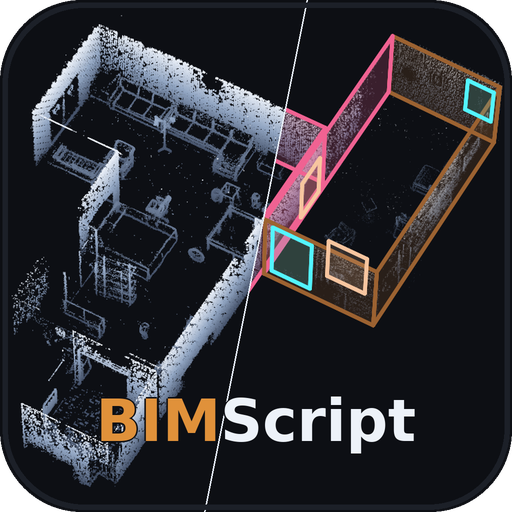

<div align="center">



# BIMScript: Material-Aware Structured Scene Programs for BIM Ingestion

**[Prakash Kondibhau Naikade](https://prakashknaikade.github.io/) · [Thomas B. Moeslund](https://vbn.aau.dk/en/persons/tbm) · [Andreas Møgelmose](https://vbn.aau.dk/en/persons/anmo)**

AI:Xpertise Lab · Visual Analysis and Perception Laboratory, Aalborg University · Pioneer Centre for Artificial Intelligence

[**Project page**](https://BIMScriptWorld.github.io/BIMScript/) · [**arXiv**](https://arxiv.org/abs/ARXIV_ID) · [**Paper**](https://arxiv.org/pdf/ARXIV_ID)

</div>

---

BIMScript reconstructs an indoor scene as a **short program of parametric commands** in which every element
carries not only geometry but the **material** and **condition** that define a building model — and each command
maps one-to-one onto a native Revit/IFC object.

- **What** — per-element `material=` and `condition=` attributes, supervised by a VLM-distilled material
  passport over 1.9M elements across ~100k scenes.
- **Fast** — decoding is bound by overhead, not compute: an output-exact CUDA-graph decoder cuts
  6.40 → 1.91 ms/step (3.4×), composed with grammar-parallel draft-and-verify.
- **Exactly where** — a bounded sub-bin offset head lifts coordinates off the 5 cm token grid.

## Code

Code release is in preparation. Planned repositories in the
[BIMScriptWorld](https://github.com/BIMScriptWorld) organization:

| Repository | Contents | Status |
|---|---|---|
| `BIMScript` | training, evaluation and decoding | coming soon |
| `bimscript-passport` | material-passport extraction pipeline and corpus | coming soon |
| `bimscript-revit` | pyRevit add-in and IFC4 export | coming soon |

## Project page

Source lives in [`docs/`](docs/) and is served by GitHub Pages at
<https://BIMScriptWorld.github.io/BIMScript/>. To preview locally:

```bash
cd docs && python -m http.server 8000   # then open http://localhost:8000
```

## Citation

```bibtex
@article{naikade2026bimscript,
  title   = {BIMScript: Material-Aware Structured Scene Programs for BIM Ingestion},
  author  = {Naikade, Prakash Kondibhau and Moeslund, Thomas B. and M{\o}gelmose, Andreas},
  journal = {arXiv preprint arXiv:ARXIV_ID},
  year    = {2026}
}
```
