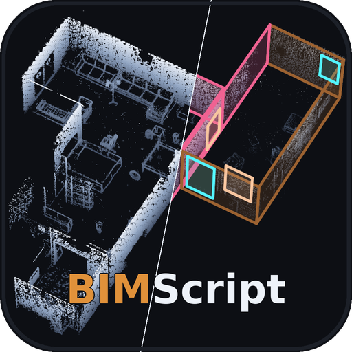
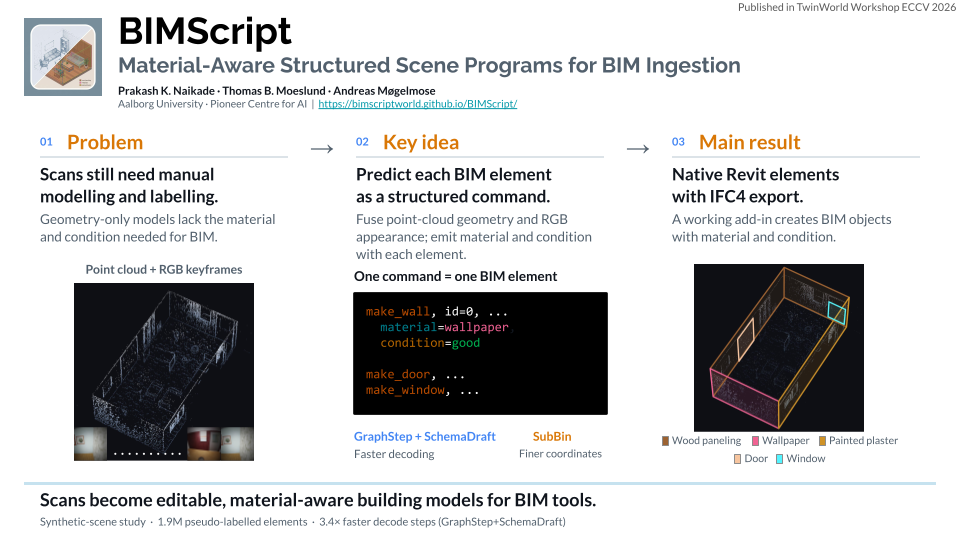
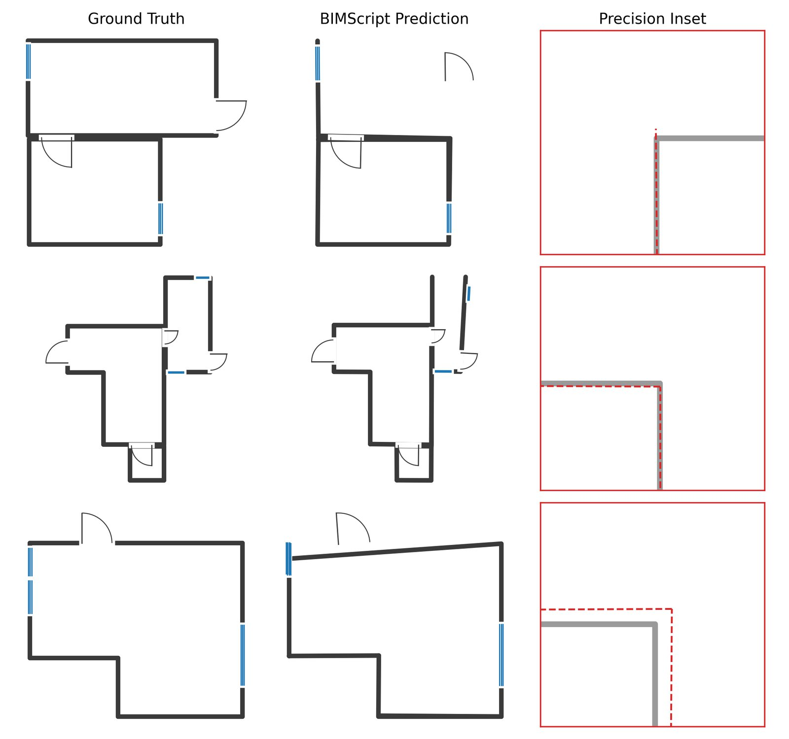
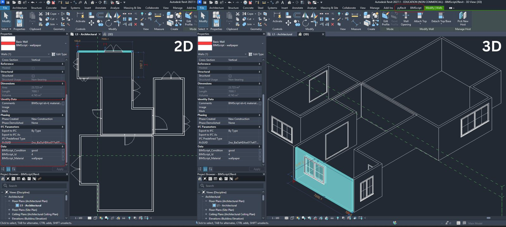

<div align="center">



# BIMScript

### Material-Aware Structured Scene Programs for BIM Ingestion

[Prakash Kondibhau Naikade](https://prakashknaikade.github.io/) · [Thomas B. Moeslund](https://vbn.aau.dk/en/persons/tbm) · [Andreas Møgelmose](https://vbn.aau.dk/en/persons/anmo)

<sub>AI:Xpertise Lab · [Visual Analysis and Perception Laboratory](https://vap.aau.dk/) · [CREATE, Aalborg University](https://www.create.aau.dk/) · [Pioneer Centre for Artificial Intelligence, Denmark](https://www.aicentre.dk/the-centre-p1)</sub>

[](https://BIMScriptWorld.github.io/BIMScript/)
[](https://arxiv.org/abs/2608.21447)
[](docs/paper/BIMScript_arxiv_2026.pdf)
[](https://youtu.be/EnbtevDCsKw)
[](https://github.com/BIMScriptWorld/ASE-Material-Passport)
[](https://github.com/BIMScriptWorld/BIMScript2Revit)
[](LICENSE)



</div>

---

## 📌 Contents

- [Overview](#-overview)
- [Highlights](#-highlights)
- [The output is a program](#-the-output-is-a-program)
- [Results](#-results)
- [Revit & IFC ingestion](#-revit--ifc-ingestion)
- [Code release](#-code-release)
- [Project page](#-project-page)
- [Citation](#-citation)
- [License](#-license)

## 🔎 Overview

BIMScript reconstructs an indoor scene as a **short program of parametric commands**. Each element carries
not only geometry but the **material** and **condition** that a building model needs, and each command maps
one-to-one onto a native **Revit / IFC** object. The paper answers three questions that stand between
structured-language scene models (such as SceneScript) and automated BIM ingestion:

| Question | Answer in BIMScript |
|---|---|
| **What** is the scene made of? | Per-element `material=` and `condition=` tokens, supervised by a VLM-distilled [*material passport*](https://github.com/BIMScriptWorld/ASE-Material-Passport) over 1.9M elements in ~100k scenes |
| How **fast** can it be produced? | **GraphStep**, an output-exact CUDA-graph decoder (3.4× per step), plus **SchemaDraft**, grammar-parallel draft-and-verify |
| **Exactly where** is each element? | **SubBin**, a bounded sub-bin offset head that lifts coordinates off the 5 cm token grid |

## ✨ Highlights

- 🧱 **Material + condition per element.** 14 materials and 5 conditions, predicted alongside geometry with no loss in layout accuracy.
- ⚡ **3.4× faster decoding.** Decoding is bound by launch and sync overhead, not compute. GraphStep cuts **6.40 → 1.91 ms/step** without retraining.
- 🎯 **Sub-grid precision.** SubBin roughly doubles F1@2 cm (**0.034 → 0.071**).
- 🏗️ **Straight into BIM.** A pyRevit add-in creates native walls, hosted doors and windows, and exports to **IFC4**.
- 🤖 **LLM-ready.** The output is plain language, so LLMs can reason over it for embodied carbon, LCA, circularity and reuse.

## 🧾 The output is a program

Real decoder output. Each line is an object with parameters, so it is readable, diffable, editable, and
maps one-to-one onto a BIM element.

```text
make_wall,   id=0, a_x=-5.922, a_y=8.741, a_z=-0.002, b_x=-1.907, b_y=8.757, b_z=-0.002,
             height=2.700, thickness=0.0, material=wood_paneling, condition=good
make_wall,   id=1, a_x=-1.907, a_y=8.757, a_z=-0.002, b_x=-1.875, b_y=1.616, b_z=-0.002,
             height=2.700, thickness=0.0, material=wallpaper,     condition=good
make_door,   id=1000, wall0_id=1, position_x=-1.891, position_y=5.186, position_z=1.012,
             width=0.920, height=2.024, material=composite,       condition=new
make_window, id=2000, wall0_id=0, position_x=-3.914, position_y=8.749, position_z=1.520,
             width=1.480, height=1.200, material=aluminum,        condition=good
```

## 📊 Results

1,000-scene held-out test split with one greedy decode per scene. Attributes are scored on elements matched
within 10 cm. Latency is batch 1 with GraphStep on one L40S.

| Model | F1@5cm | Avg F1 | Coverage | Mat. acc. | Cond. acc. | Params | s / scene |
|---|:-:|:-:|:-:|:-:|:-:|:-:|:-:|
| SceneScript (public ckpt) | **0.581** | 0.667 | — | — | — | 25.9M | 1.47 |
| BIMScript (40k) | 0.577 | **0.676** | **0.701** | 0.629 | **0.842** | 58.4M | 1.14 |
| BIMScript+ (60k) | 0.576 | 0.669 | 0.699 | **0.639** | 0.840 | 58.5M | **1.12** |

Adding material and condition leaves geometry accuracy unchanged. **BIMScript+** is a single checkpoint
that supports plain decoding, draft-and-verify and sub-bin refinement.

<div align="center">

</div>

## 🏗️ Revit & IFC ingestion

<div align="center">

</div>

| BIMScript | Revit API target | IFC entity / property set |
|---|---|---|
| `make_wall` | `Wall.Create` (curve, level, height) | `IfcWall` |
| `make_door` | hosted `FamilyInstance` on host wall | `IfcDoor` + `IfcRelFillsElement` |
| `make_window` | hosted `FamilyInstance` on host wall | `IfcWindow` + `IfcRelFillsElement` |
| `material=…` | wall/family-type material parameter | `IfcMaterial` / `IfcMaterialLayerSet` |
| `condition=…` | shared parameter (custom) | custom Pset (e.g. `Pset_Condition`) |

## 📦 Code release

All repositories live in the [BIMScriptWorld](https://github.com/BIMScriptWorld) organization. The material-passport pipeline and the Revit add-in are released; the main training code is being prepared.

| Repository | Contents | Status |
|---|---|---|
| [`BIMScript`](https://github.com/BIMScriptWorld/BIMScript) | Training, evaluation and decoding | 🚧 Coming soon |
| [`ASE-Material-Passport`](https://github.com/BIMScriptWorld/ASE-Material-Passport) | Material-passport extraction pipeline and corpus | ✅ Available |
| [`BIMScript2Revit`](https://github.com/BIMScriptWorld/BIMScript2Revit) | pyRevit add-in and IFC4 export | ✅ Available |

> ⭐ **Star or watch** this repository to be notified when the training code is released.

## 🌐 Project page

The page source is in [`docs/`](docs/) and is served by GitHub Pages at
**<https://BIMScriptWorld.github.io/BIMScript/>**. To preview it locally:

```bash
cd docs && python -m http.server 8000   # then open http://localhost:8000
```

## 📖 Citation

If you find BIMScript useful, please cite:

```bibtex
@misc{naikade2026bimscript,
  title         = {BIMScript: Material-Aware Structured Scene Programs for BIM Ingestion},
  author        = {Naikade, Prakash Kondibhau and Moeslund, Thomas B. and M{\o}gelmose, Andreas},
  year          = {2026},
  eprint        = {2608.21447},
  archivePrefix = {arXiv},
  primaryClass  = {cs.CV},
  url           = {https://arxiv.org/abs/2608.21447}
}
```

## 📄 License

This repository is released under the [MIT License](LICENSE). The project page template is adapted from
[Nerfies](https://github.com/nerfies/nerfies.github.io) under
[CC BY-SA 4.0](http://creativecommons.org/licenses/by-sa/4.0/).
